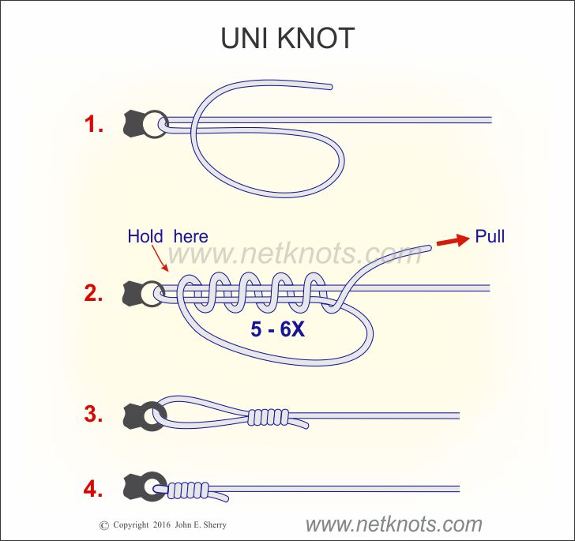
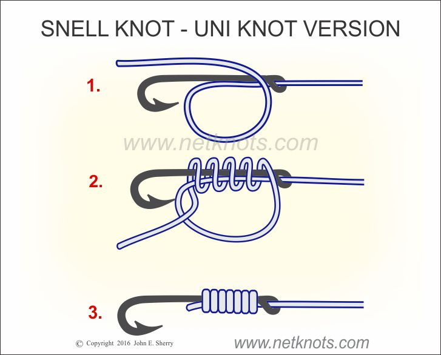
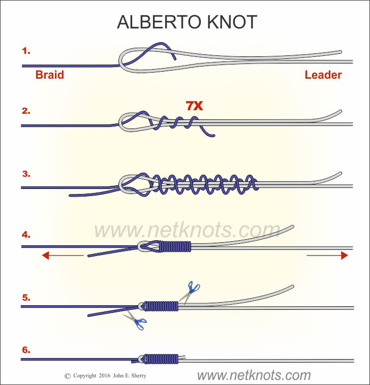

# Fishing Knots (Field Card)

**Uni** — line to terminal tackle · **Uni Snell** — line to bait hook · **Alberto** — braid to leader. Wet every knot before cinching. Diagrams: John E. Sherry / netknots.com.

## Uni Knot

{ width="300" }

## Uni Snell Knot

{ width="300" }

## Alberto Knot

{ width="300" }
