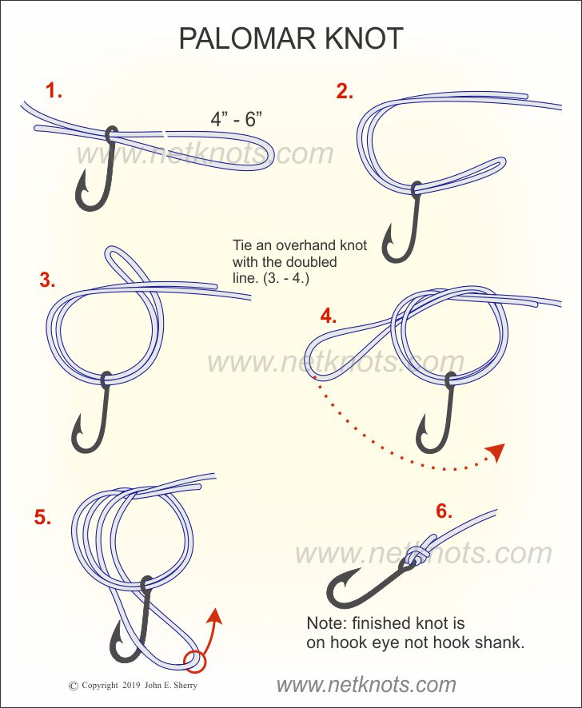

# Fishing Knots (Field Card)

**Uni** — line to terminal tackle · **Uni Snell** — line to bait hook · **Alberto** — braid to leader · **Double Palomar** — braid to swivel. Wet every knot before cinching. Diagrams: John E. Sherry / netknots.com.

[**Printable 1-page card (PDF)**](fishing_knots_card.pdf) — all four knots, letter size.

## Uni Knot

{ width="300" }

## Uni Snell Knot

{ width="300" }

## Alberto Knot

{ width="300" }

## Double Palomar Knot

Braid to snap swivel. Tie the Palomar below, but **repeat steps 3–4 — a second overhand wrap through the same loop — before passing the loop over the swivel.** That second wrap is the only difference, and it's what keeps slick braid from slipping.

{ width="300" }
